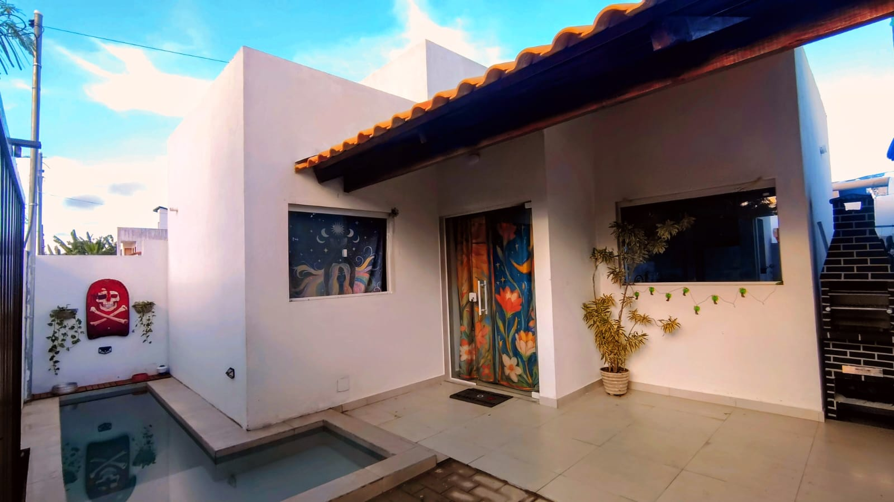
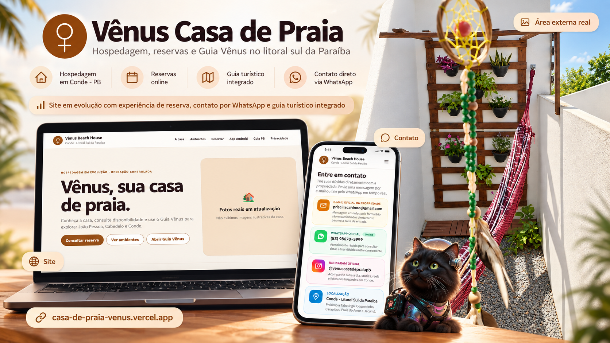
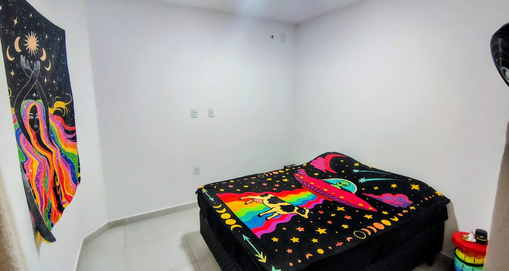
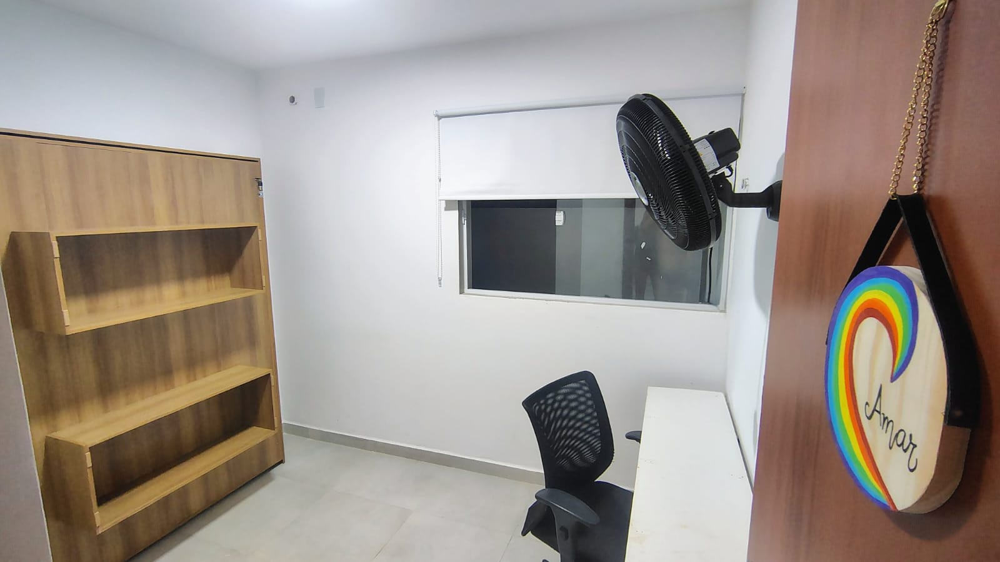
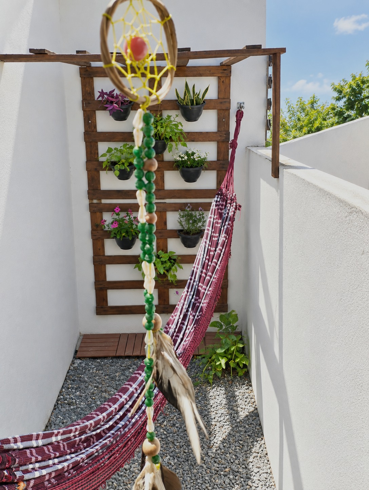
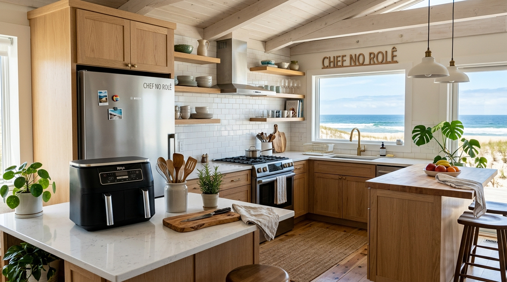
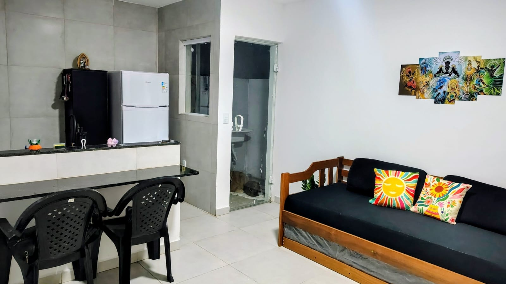
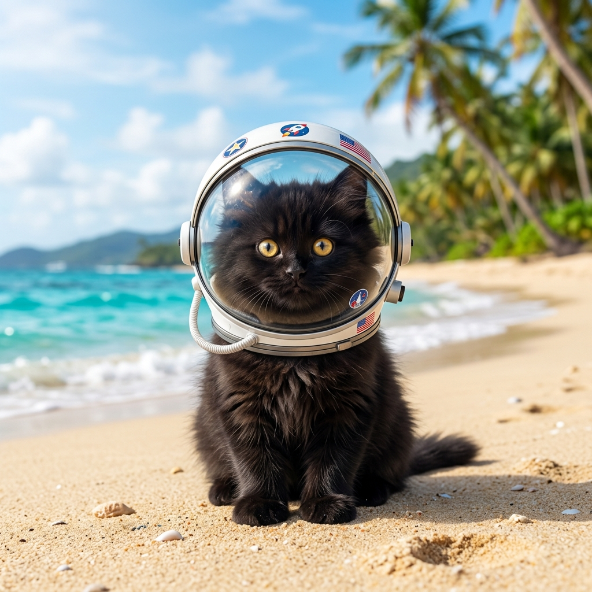

# Vênus Casa de Praia 🏖️

### Uma casa de praia real transformada em uma experiência digital.

**Conde · Litoral Sul da Paraíba**

[Ver site](https://casa-de-praia-venus.vercel.app/) ·
[Instagram](https://www.instagram.com/venuscasadepraiapb/) ·
[Guia Vênus PB](https://guia-lugares-pb.vercel.app/)

---

  

## 🌴 O projeto

A **Vênus Casa de Praia** nasceu como um projeto pessoal para organizar e melhorar a experiência de quem se hospeda na casa.

A ideia é simples: quem conhece a Vênus pelo Instagram consegue entrar no site, conhecer os ambientes, consultar datas, iniciar uma reserva, continuar o atendimento pelo WhatsApp e acompanhar a confirmação.

Além da hospedagem, o projeto também conecta o hóspede ao **Guia Vênus PB**, com indicações para aproveitar melhor João Pessoa e o Litoral Sul da Paraíba.

> Um projeto que une **experiência do cliente, organização de processos, UX/UI e tecnologia** em uma situação real.

---

## 🌐 Veja o projeto em funcionamento

A Vênus já possui uma experiência digital navegável, criada para apresentar a casa, facilitar o contato e organizar a jornada do hóspede.

  

  <strong>👉 <a href="https://casa-de-praia-venus.vercel.app/">Acessar a Vênus Casa de Praia</a></strong>

A imagem acima reúne elementos reais do projeto e da identidade visual para apresentar, em uma única composição, a evolução da casa para uma experiência digital.

---

## 🏡 Conheça a casa

<table>
<tr>
<td width="50%" align="center">
 
<b>Fui abduzido 👽🛸</b>
</td>
<td width="50%" align="center">
 
<b>Escritório no Paraíso 💻🌴</b>
</td>
</tr>

<tr>
<td width="50%" align="center">
 
<b>Suave na nave 🌴🪢</b>
</td>
<td width="50%" align="center">
 
<b>Ilhado em Vênus 🏊‍♂️🥩</b>
</td>
</tr>

<tr>
<td width="50%" align="center">
 
<b>Chef no rolê 🍳🧑‍🍳</b>
</td>
<td width="50%" align="center">
 
<b>Divindade ancestral 🎬✨</b>
</td>
</tr>
</table>

🏊 Piscina privativa &nbsp; • &nbsp;
🔥 Churrasqueira &nbsp; • &nbsp;
💻 Home Office &nbsp; • &nbsp;
🐾 Pet Friendly &nbsp; • &nbsp;
👥 Até 6 hóspedes

---

## 🌊 Perto de alguns dos cenários mais bonitos da Paraíba

<table>
<tr>
<td width="50%" align="center">
 
<b>Tabatinga</b>
</td>
<td width="50%" align="center">
 
<b>Coqueirinho</b>
</td>
</tr>
</table>

A casa fica em **Conde-PB**, próxima a Jacumã, Carapibus, Praia do Amor, Tabatinga, Coqueirinho e outros destinos do Litoral Sul.

---

## ✨ Da descoberta à confirmação

**Instagram**
↓
**Conhece a casa**
↓
**Consulta as datas**
↓
**Solicita a reserva**
↓
**Continua pelo WhatsApp**
↓
**Acompanha a confirmação no site**

O objetivo é deixar a jornada mais clara, simples e organizada, sem depender de várias conversas e informações espalhadas.

---

## 🗺️ Guia Vênus PB

O projeto também integra um guia turístico próprio com praias, gastronomia e lugares para conhecer.

A ideia é que a experiência não termine na hospedagem: a Vênus também ajuda o visitante a descobrir a região.

<b>Casa + hospedagem + turismo local em uma única experiência.</b>

---

## 🐾 A anfitriã

A identidade do projeto é inspirada na **Vênus**, mascote da casa.

Ela representa o lado leve, acolhedor e divertido da experiência — presente desde o visual até os nomes dos ambientes.

---

## 💡 O que este projeto representa

Este projeto foi criado para explorar, na prática:

**CX / Customer Experience** · **Customer Success** · **UX/UI** · **Processos** · **Reservas** · **Atendimento** · **Tecnologia**

O foco não é apenas desenvolver uma aplicação, mas pensar na experiência completa: antes, durante e depois da hospedagem.

---

## 🛠️ Por trás da experiência

`Web/PWA` · `Node.js` · `SQLite` · `JavaScript` · `Kotlin` · `Jetpack Compose` · `GitHub Actions`

Os detalhes de arquitetura, segurança, reservas, pagamentos e homologação ficam na pasta [`docs/`](docs/), mantendo este README focado na **apresentação do projeto**.

---

## 🚧 Status

**Projeto em evolução e homologação.**

A experiência visual e os principais fluxos já estão implementados. A operação comercial definitiva ainda depende da conclusão das etapas de produção e validação.

O acompanhamento atualizado está em [`docs/CHECKLIST_PUBLICACAO_V2_3_7.md`](docs/CHECKLIST_PUBLICACAO_V2_3_7.md).

---

### Vênus, sua casa de praia! 🌴

**Projeto pessoal de Priscilla Cahino**

[GitHub](https://github.com/Priscillacahino)

